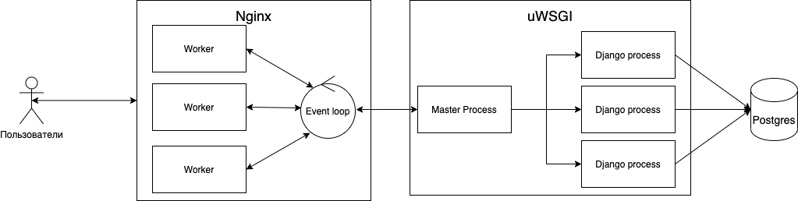

# Развертывание сайта кинотеатра
Виртуализация осуществляется в Docker.

## Схема сервиса

## Основные сервисы в docker-compose:
1. **postgres** - PostgreSQL с базой кинотиатра (пустой базой, но проделаной первой миграции для создания необходимых таблиц)
2. **backend** -  gunicorn serves django app
3. **nginx** - proxy-сервер для Django приложения

## Перед запуском docker-compose
1. В директории movies_admin надо настроить .env_example в соответствие с требованиями проекта movies_admin.
   Обязательно указать:
   - DJANGO_POSTGRES_SCHEMA_NAME `content`
   - DJANGO_SETTING_MODULE `config.settings.production`
   - DJANGO_STATIC_ROOT `/opt/app/static/`
   - DJANGO_MEDIA_ROOT `media:/opt/app/media/`
   - DJANGO_ALLOWED_HOSTS указывать через пробел
   - остальные также обязательны, смотрите на каких портах что работает в docker-compose
2. Переименовать .env_example -> .env

## Запуск docker-compose
docker-compose up --build -d

## Доступность сервиса
Сервис кинотеатра будет доступен по 80 порту Админка: 
http://<server_address>/admin
